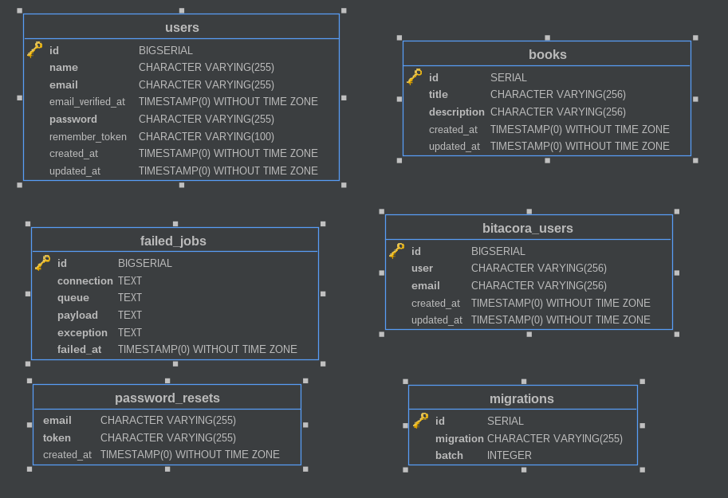

# Laravel Test

## Requerimientos

1. Crear un CRUD en Laravel x
2. Entregar el modelo ER
3. Generar el Script de la base de datos
4. El CRUD debe contener un Login y register
5. Crear un trigger que dispare un SP(en donde inserte los datos del user en otra tabla llamada bitácora_user).
5. Usar el Patrón MVC
6. Registrar al menos 10 users


## Initialize application

Config env.example file with his own variables

 ```
composer install

composer dump-autoload

php artisan view:cache

npm install

php artisan migrate

 ```


## Modelo ER



## DataBase Script
The anothers script are loaded in the migration setup

### StoreProcedure

```sql
CREATE PROCEDURE SP_LogUser(_username character varying, _email character varying)
LANGUAGE SQL
AS $$
    INSERT INTO bitácora_user(user, email, created_at)
    VALUES(_username, _email, NOW()); 
$$;
```


### Trigger
```sql
CREATE OR REPLACE TRIGGER TRG_LogUser
   AFTER INSERT OR UPDATE ON users
   FOR EACH ROW

   BEGIN
    CALL SP_LogUser(:new.email);
   END;
```
